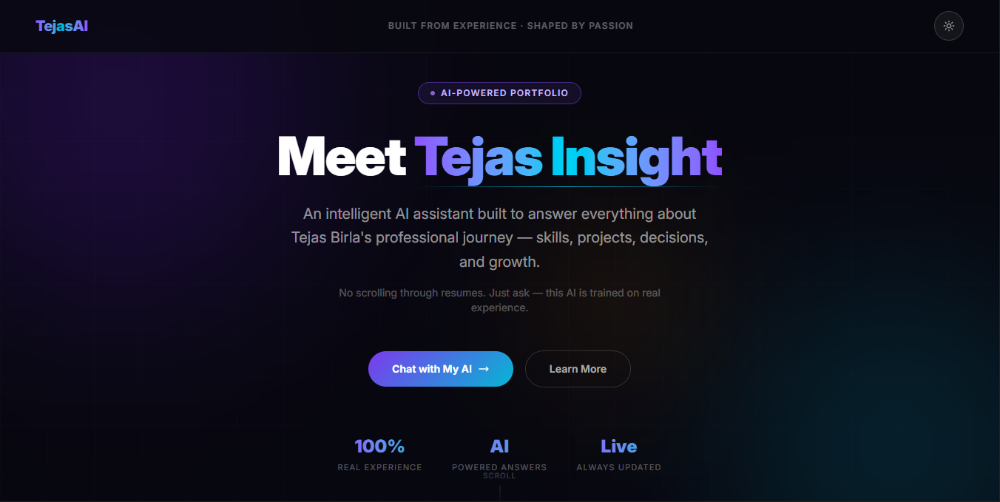
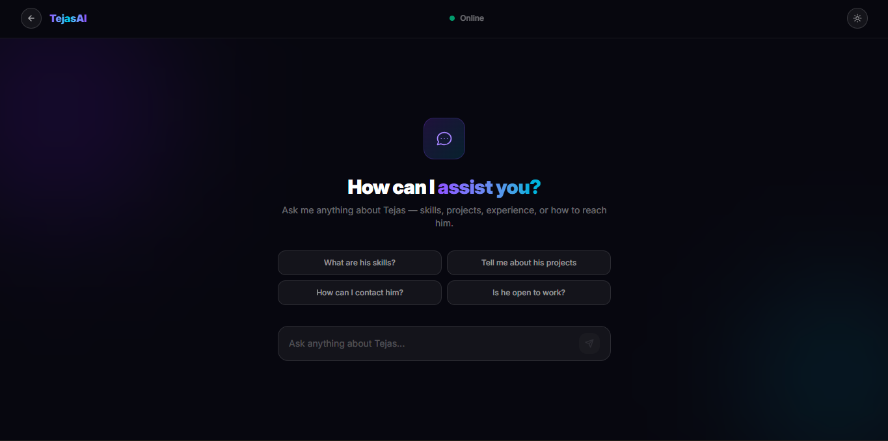
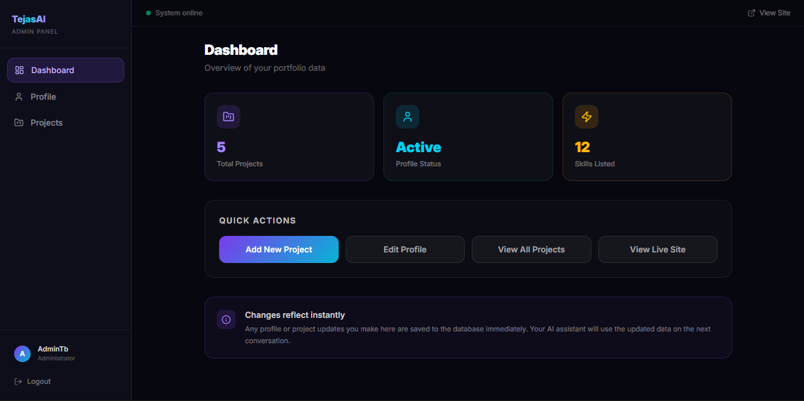

# TejasAI — Personal AI Portfolio Assistant

A full-stack AI-powered portfolio assistant built with the MERN stack. Visitors can chat with an intelligent assistant that answers questions about Tejas Birla's skills, projects, experience, and contact details — in real time via WebSockets. A separate admin panel allows managing profile and project data without touching the database directly.

---

## 🔗 Live Link

[🚀 Visit TejasAI](https://tejasai.vercel.app)

---

## Screenshots

### Home Page

### Chat Page

### Admin Panel

---

## Tech Stack

**Backend** — Node.js, Express.js, MongoDB, Mongoose, Socket.IO, Google Gemini API, JWT, bcrypt

**Frontend** — React.js, Vite, Tailwind CSS v4, DaisyUI, Socket.IO Client, React Markdown

**Admin** — React.js, Vite, Tailwind CSS v4, Lucide React, React Router DOM

---

## Features

### Public Frontend

- **AI Chat Assistant** — real-time chat via Socket.IO powered by Google Gemini
- **5-Tier Intent System** — greeting → known intent → project name → off-topic filter → Gemini fallback
- **Typo-Tolerant Project Matching** — Levenshtein distance algorithm (no external library)
- **Off-Topic Detection** — rejects math, jokes, weather, etc. without calling the API
- **Rate Limiting** — prevents API abuse (5s cooldown per socket)
- **Suggestion Chips** — quick-start prompts for visitors
- **Dark / Light Theme** — persisted in localStorage
- **Chat History** — persisted in localStorage across sessions
- **Responsive Design** — mobile-first, dark futuristic aesthetic

### Admin Panel

- **JWT Authentication** — login with username + password, token stored in Context + localStorage
- **Protected Routes** — all admin pages behind `ProtectedRoute` guard
- **Dashboard** — stats overview (projects count, profile status, skills count) with modals
- **Profile Management** — edit bio, skills, hobbies, contact, availability toggles
- **Project Management** — add, edit, delete projects with tech stack + features tags
- **Instant Reflection** — AI uses updated data on the very next conversation

---

## AI Chat Architecture

The chat controller uses a **5-tier system** to minimize Gemini API calls:

| Tier | Trigger                                         | Response                        |
| ---- | ----------------------------------------------- | ------------------------------- |
| 1    | Greeting (`hi`, `hello`)                        | Instant local reply             |
| 2    | Known intent (skills, contact, education, etc.) | Instant local reply             |
| 3    | Project name (exact + typo match)               | Instant local reply             |
| 4    | Off-topic (math, jokes, weather)                | Polite rejection, zero API call |
| 5    | Open/ambiguous question                         | Gemini API (advocate mode)      |

This reduces unnecessary Gemini API calls by ~85%.

---

## Author

**Tejas Birla** — MERN Stack Developer

> Built as a personal portfolio project to showcase full-stack + AI integration skills.
